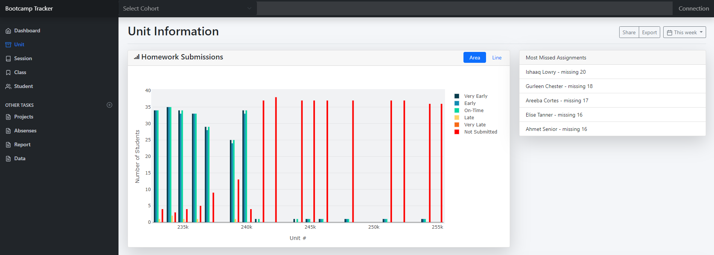
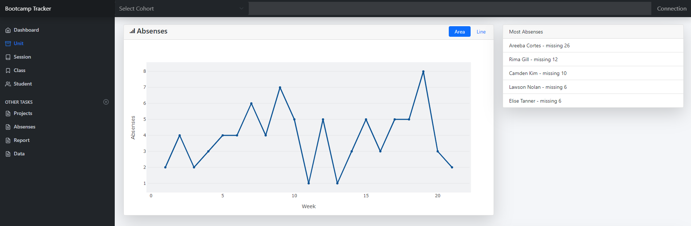
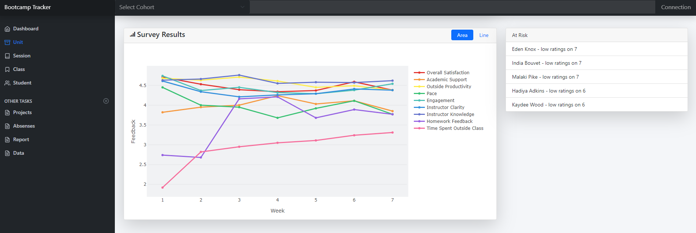
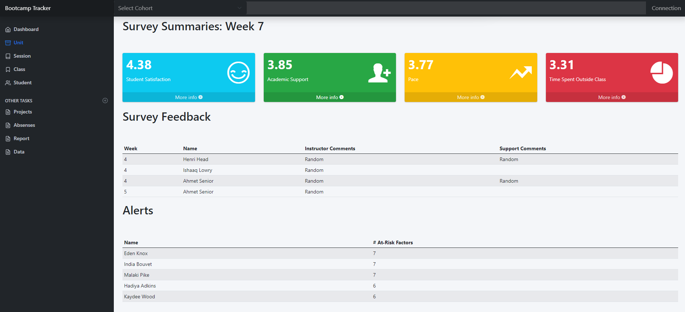
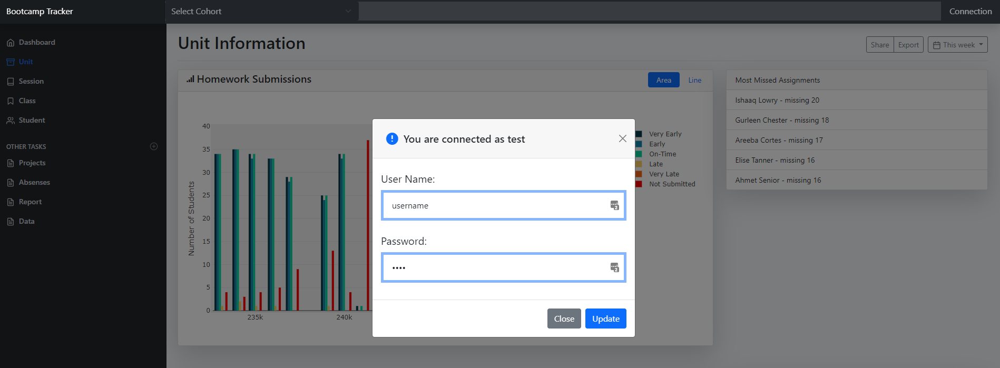
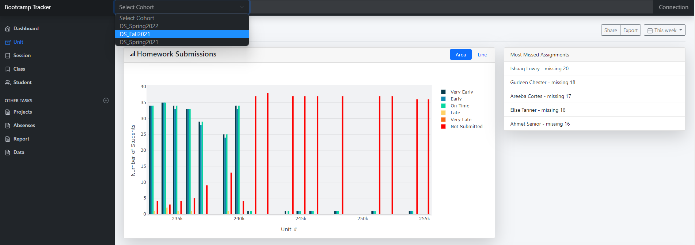

# proj-gradebook  

Author:  Erin James Wills, ejw-data@gmail.com  

  
<cite>Photo by <a href="https://unsplash.com/@taypaigey?utm_source=unsplash&utm_medium=referral&utm_content=creditCopyText">Taylor Wilcox</a> on <a href="https://unsplash.com/s/photos/grade?utm_source=unsplash&utm_medium=referral&utm_content=creditCopyText">Unsplash</a></cite>  

<br>

## Overview  
<hr>  

> Development of a database, flask server, and bootstrap dashboard that will aid in monitoring student performance.  

This is a multiphase project.  The goal is to develop a gradebook flask application that help identify student achievement and more specifically to identify students who are experiencing challenges with course content.  Identifying individual student challenges is often overlooked in favor of looking at aggregated data that describes the overall class performance.  Below are the different phases.  Not all phases of this project will be made public.  This early flask app development is probably one of the few parts that will be made public since it only uses fictitional data.  Future work will need to use real data and the time to redact or develop realistic fake datasets is not time efficient.  

**Phases**
1.  Create database schema that could collect common information  
1.  Create realistic dataset based on schema  
1.  Develop queries that will pull data from database   
1.  Create HTML dashboard interface with plots   
1.  Develop Flask api server that pulls data from the database  
1.  Create Jupyter Notebook that pulls real course data via API and analyzes it  
1.  Develop scripts that update the database with new data and modify the schema as needed  
1.  Modify/Update queries  
1.  Add additional security to the app including a login page  
1.  Deploy to a private hosting platform  

**Current Status**  
This repo holds the content of the database schema, fake data, and Flask server with HTML interface.  This means that Phases 1,2,3,4,and 5 are approaching completion with most of those steps being completely done.  Phases 6 is also complete but contains priveleged information and will not be added to a public repository.  The remaining steps have not been started.  

**Upcoming Tasks**
Phase 5 is only partially complete and additional routes need to be developed to replace the placeholder data found in the webpages.  Some additional graphics will need to be developed to have the student-centered effect the project mission was to serve.  The next step will also involve developing scripts that will update a database as part of Phase 7.  

**Other Considerations**
A strategy has been developed to create a `utility.db` database that will contain settings for the application and create a way of introducing and updating monitoring guidelines and tools.  

<br>

## Technologies  
*  Python
*  Pandas
*  Matplotlib
*  SQLite
*  SQLAlchemy
*  HTML/CSS/JS
*  Plotly
*  Bootstrap5

<br>  

## Data Source  

The data files (CSV files and SQLite files) in this repo are fake and designed based on a schema that I made.  The choices mimic the type of data that is typically found in the Microsoft SQLExpress sample database which is also about school enrollments and my person experiences working in education.  

<br>

## Analysis

### Frontend -  User Interface   

The user interace for the application is made with the Bootstrap5 framework with Plotly charts.  Since many parts of the website are repeated, flask templates and flask template parts were used so page element were modular.  In in a similar manner, javascript functions were made that generate the plot based on the plot type.  This will aid with future modifications and site consistency.  

The flask webpages can be found in the `templates` folder.  There are currently five pages including:  
    *  index.html
    *  class.html
    *  session.html
    *  student.html
    *  unit.html  

Repeated page elements are found in the [base template](https://flask.palletsprojects.com/en/2.1.x/tutorial/templates/) page:  layouts.html
    *  Currently, data is connected to each page through the `data.js` referce but the `unit.html` page uses only flask API data.
    *  Functions for plotting are connected to each page through the `myChart.js` reference.  
    *  The modals are connected to the page through the `myModal.js` reference.    

Charts are added through `flask macros` in coordination with `javascript functions`.   

Icons for the website come from [`ionicons`](https://github.com/nbs-it/ionicons-v2.0.1)  

<br>


<cite>Fig 1.  Unit Page (top fourth)</cite>

<br>


<cite>Fig 2.  Unit Page (middle fourth)</cite>

<br>


<cite>Fig 3.  Unit Page (middle fourth)</cite>

<br>


<cite>Fig 4.  Unit Page (bottom fourth)</cite>

<br>


<cite>Fig 5.  Fake Login (modal)</cite>

<br>


<cite>Fig 6.  Cohort Selection (populated from API)</cite>

<br>

## Backend - SQLite and Flask

SQLite files are generated using SQLAlchemy and the ORM.  The data is also contained in the form of CSV files.
The schema model can be found in the `notebook` folder within the `db_setup.ipynb` notebook.  The data is added through the `db_insert.ipynb` notebook in the same folder.  Sample queries can be found in the `db_query.ipynb` notebook.  

Queries using the SQLite database were developed using [DBeaver](https://dbeaver.com/).  This software works as an interface program similar to what `pgAdmin` is to `PostgreSQL`.  DBeaver can be used to interact with multiple RDBMS.  Examples of the queries can be found in the `queries` folder.   

Here is an example of a query that bins student homework submission status into bins like "very late", "late", "early", "very early", etc:  

```
With studentCTE(student_id, person_id,sCTEcohort_id) AS 
	(SELECT student_id, person_id, cohort_id
	FROM student s 
	WHERE cohort_id = 
		(SELECT c.cohort_id 
		FROM cohort c 
		WHERE DATE() > c.start_date
		AND DATE() < c.end_date
		)
	), 
unitCTE (unit_id, uCTEcohort_id, unit_due) AS 
	(SELECT unit_id, cohort_id, unit_due
	FROM unit u
	WHERE cohort_id = 		
		(SELECT c.cohort_id 
		FROM cohort c 
		WHERE DATE() > c.start_date
		AND DATE() < c.end_date
		)
	AND unit_required = 1
	AND unit_due < DATE()
	)
SELECT sb.unit_id, label, COUNT(1) AS Total_Submissions, ROUND(JULIANDAY(sb.submission_date) - JULIANDAY(unitCTE.unit_due)) as days_from_due_date, DENSE_RANK() OVER(ORDER BY sb.unit_id) as week
FROM submission sb
INNER JOIN studentCTE 
ON sb.student_id = studentCTE.student_id
INNER JOIN unitCTE
ON sb.unit_id = unitCTE.unit_id  
LEFT JOIN (
SELECT attendance_status.*, lead(bin) OVER (ORDER BY bin NULLS FIRST) AS next_bin
from attendance_status) b 
ON (bin IS NULL OR days_from_due_date >= bin) AND (next_bin IS NULL OR days_from_due_date < next_bin)
GROUP BY sb.unit_id, label;
```

<br>

## Setup and Installation  
1. Create conda environment for Python version 3.9.9 but 3.6+ should be fine
1. Generate project environment using venv:  `python -m venv venv`
1. Activated environment:  `. venv/Scripts/activate`
1. pip install the following:    
    *  `pip install Flask` 
    *  `pip install -U Flask-SQLAlchemy `
    *  `pip install sqlalchemy-utils `
1. After cloning the repository, you will need to access a terminal within the repo's root directory
1. Make sure for this task and all future tasks that you activate your environment each time.
1. The databases already exist in the rep and the flask app can be run immediately.  To regenerate the gradebook database, you need to:  
    1.  Open a Jupyter Notebook within the environment from the repo.
    1.  Navigate to to the notebooks folder and run these notebooks:
        1.  `db_setup.ipynb`
        1.  `db_insert.ipynb`
    1.  The SQLite database structure will be generated in the notebooks folder as `gradebook.db`.  It will initially be empty until the `db_insert.ipynb` is run and at that time the data from the `gradebook_csv` folder will be imported into the database.  All of this data is fictional and was developed by the author to be similar to real data.  
    1.  It is optional to run the `db_query.ipynb` notebook.  This notebook demonstrates several ways of extracting data from the database.  Similar code is used in `query.py`.    
    1.  There are two other SQLite databases included in the repo.  The `utilities.db` is empty but plans are to use it in the future to hold special trend data that can be used to make control charts and customize alerts and settings for the app.  The other database is the `login-flask.db` which is used to store fake login information used to test the html login interface.   The content of this database is not needed for the flask app at this time.
1.  To run the Flask app, open git bash or terminal to the repo folder and type `python app.py` and go to the indicated virtual server.   

<br>

>**Note**:  Not all flask pages have been developed.  The page that is nearly complete is the `Units` page.  As I have time I come back and work on this project with goals of putting in 3-5 hours per every couple months.  The fake but representative database has already been made so queries can be developed from it and the main HTML/CSS/JS structure is alrady in place.  These parts will probably be the only publicly accessible parts of the project.  These documents were built in early 2022 and a private version has been developed since May 2022.  Multiple jupyter notebooks have been developed that extract the data and manipulate it so gain significant insights about students.  The tools for adding this content to a database has already been developed also.  The final steps are to create API routes and HTML interface so the notebook can be used on a server without needing python installed.    
